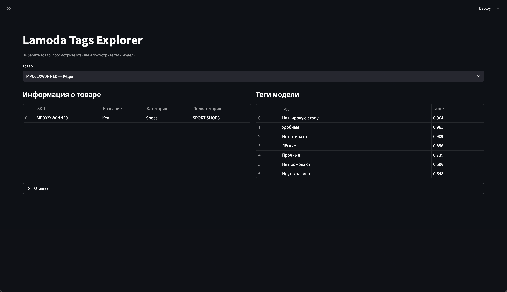

# Lamoda Tags

Автоматическая генерация тегов для товаров Lamoda на основе отзывов покупателей.

## Описание
Проект — приложение для суммаризации отзывов через multilabel классификацию курируемого и предсказуемого набора тегов. 
Идея — сохранить высокий уровень полезности и интерпретируемости вывода, сведя разрозненные теги (сотни/тысячи) 
к компактному пулу ~20–30 эталонных тегов на 8 категорий, при этом оставив возможность предсказывать 1–6 релевантных тегов для каждого отзыва.

## Быстрый старт 
1. Открыть ноутбук `All berts__.ipynb`
2. Lora слои и все необходимое качается по gdown внутри ноутбука
3. Можно протестировать как на своем предложении, так и на реальных отзывах в Lamoda

## Подход

Всего возможное пространство исходных тегов избыточно (3000+), а, вероятно, и бесконечно — можно свести его до топ-30 информативных тегов на категорию без потери полезности.

Идея: предсказывать курируемый набор тегов, наиболее полно отражающий свойства отзывов. 

### Архитектура 

- Задача: multilabel prediction, возвращаем 1–6 тегов.

- Модель: sentence BERT (user-bge-m3 как базовый encoder) + LoRA-дообучение на каждом кластере категорий.

- Routing Lora слоев под категорию: в зависимости от категории — активируется соответствующий слой Lora.

- Эталонные метки: пул из 20-30 меток для каждой категории (всего 100+) `Etalon tags.ipynb`

### Датасет 

8 тысяч стеков отзывов (all_texts, tags) - `datasets`
- Разметка тегами от LLM (Qwen 3 4b Instruct) 
- Получившееся пространство тегов (1000-3000) сводим к топ-30 наиболее информативным и полезными с llm curation + финально human curation 
  - Проблема - нужно замаппить огромный пул сырых тегов для всего датасета в наши эталонные
  - Решение - смотрим semantic sim сырых тегов с эталонными, оставляем наилучшие - `Bags_labels_to_etalon.ipynb` 

### Преимущества 
- Очень быстрый инференс
- Не требует больших ресурсов
- Выходные теги - курируемые, всегда качественно сформулированы, имеют высокую полезность 
- Можно дообучать, расширять/чистить датасет - итеративно улучшая реально достичь очень высокого качества

### Возможные улучшения
- Глубокий fine-tuning bert трансформера под домен e-commerce
- Улучшить качество разметки тегов - crowd / больший llm
- Расширить датасет - чем больше, тем лучше работает Lora
- Оптимизация предпочтений - модерировать пул эталонных меток на основе ОС от пользователей

### Тренировка

Для каждой категории — отдельный LoRa слой.

- LoRA fine-tuning на 500 – 2 000 примерах
- Обучение можно найти в `loras_learning`
- Потери/метрики считаем multilabel (BCE loss, F1, precision@k, recall@k)
- Обучение на 3-7 эпохах
- В среднем F1 на все слои около 0.7

### Инференс и Routing

- Вход: аггрегированный текст из отзывов по товару + категория.

- В зависимости от категории маршрутизация на соответствующий Lora слой.

- Он классифицирует от 1 до 6 тегов (threshhold 0.5, можно менять)

- Выход: качественный набор тегов, наиболее полно отражающий отзывы
  - Пример: `['Приятный материал', 'Не жмет', 'Дышит', 'Качественный принт']`

### Замечания и практический опыт

Попытка использовать один bert на все категории дала плохое качество — поэтому архитектурно выгодно иметь по модели на категорию.
Подробнее про другие эксперименты можно прочитать в `README_old.md`

## Установка

```bash
# Установить зависимости
pip install uv
uv sync

# Для разработки (jupyter, визуализация)
uv sync --extra dev
```

### Streamlit UI

Простой интерфейс для просмотра товаров, отзывов и тегов модели (по умолчанию без «истинных» тегов в датасете):

```bash
streamlit run app.py
```



Приложение:
- Загружает товары из `lamoda_reviews_sampled.csv` (без колонки `tags`).
- Позволяет выбрать SKU и посмотреть исходные отзывы.
- Показывает предсказания тегов с вероятностями.

#### LoRA-режим

Streamlit (и `model/LoraTagPredictor`) берёт:
- **LoRA-адаптер** по `good_type` из папки `lora_model/`
- **базовую модель** из локального `hf_models/` (если скачана), иначе попытается взять с HuggingFace Hub.

Маппинг по `good_type`:
- `Bags` → `lora_bert_output_bags`
- `Shoes` → `lora_bert_output_shoes`
- `Clothes` → `lora_bert_output_clothes`
- `Beauty_Accs` → `lora_bert_output_beauty`
- `Accs` и `Home_Accs` объединены → `lora_bert_output_accs`
- `Toys` и `Jewellery` не были обучены → `lora_bert_output_accs`

##### Скачать LoRA-адаптеры

```bash
python scripts/download_lora_models.py --out-dir lora_model
```

Можно также скачать в `All berts__.ipynb` через gdown
```python
!gdown 1iXzXQXyHQ-veqCQQbv6WH9vqgJWgpSGz
!gdown 1hWm6FEF0pMlz8PvTsiYemW3LEIhfBTqm
!gdown 1zsZWveqfa08nL-pOQJ2VfFSf5ucabk7k
!gdown 1Js_bwCWCb39-lFWVKzWqFSuq-RmdXeO_
!gdown 1HW3CUIqOPyXOet_LSwpUQvSN4cfCEf6k

!unzip lora_bert_output_clothes.zip -d lora_bert_output_clothes
!unzip lora_bert_output_shoes.zip   -d lora_bert_output_shoes
!unzip lora_bert_output_beauty.zip  -d lora_bert_output_beauty
!unzip lora_bert_output_accs.zip    -d lora_bert_output_accs
!unzip lora_bert_output_bags.zip    -d lora_bert_output_bags
```

Ожидаемая структура:

```
lora_model/
  lora_bert_output_bags/
  lora_bert_output_accs/
  lora_bert_output_beauty/
  lora_bert_output_clothes/
  lora_bert_output_shoes/
```

##### Скачать базовую HF-модель локально (веса + токенайзер)

```bash
python scripts/download_hf_model.py --model-id deepvk/user-bge-m3 --local-dir hf_models/user-bge-m3
```

Важно: в `hf_models/<...>/` должны быть файлы весов (`*.safetensors` или `pytorch_model*.bin`).  
Если там только `tokenizer.json/config.json`, значит скачался не тот формат (например, sentence-transformers без весов для Transformers).

CLI:

```bash
predict-tags --text "Отличные кроссовки, легкие и удобные" --good-type "Shoes"
```


